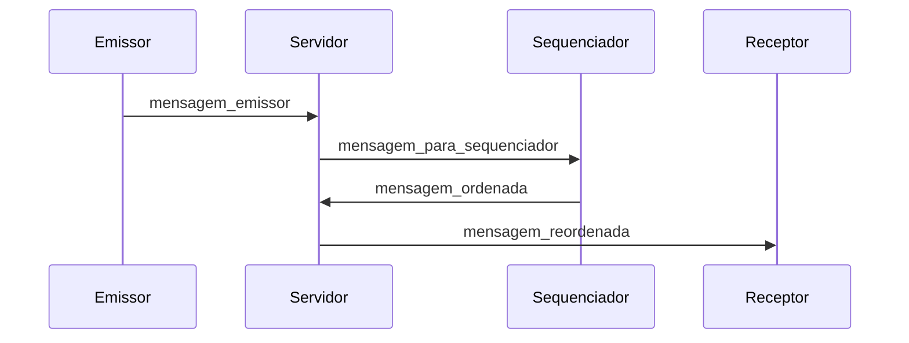

#   Trabalho Prático – Sistemas Distribuídos (Grupo 2)

**Tema:** Sequenciador Móvel

**Disciplina:** Sistemas Distribuídos – UFSC Araranguá – 2025.1

**Integrante:** João Marcos Moço, Gabriel Juliani e Nicolas Sanson

##   Descrição da Proposta

O projeto implementa um sistema distribuído com sequenciador móvel, onde múltiplos clientes (emissores, receptores e sequenciadores) se conectam a um servidor central. O sequenciador é responsável por garantir a ordenação global das mensagens trocadas entre os clientes. O papel de sequenciador pode ser transferido dinamicamente, promovendo tolerância a falhas e flexibilidade ao sistema.

A aplicação possui uma interface web interativa, que exibe em tempo real:

- Mensagens enviadas e recebidas;

- Ordem das mensagens;

- Sequenciador atual;

- Um console de eventos em tempo real.

## Requisitos Funcionais

  

###  Cliente

  

-  **Identificação**: Cada cliente se conecta informando seu tipo (`emissor`, `receptor` ou `sequenciador`).

-  **Emissor**: Envia mensagens de texto ao servidor, que serão ordenadas pelo sequenciador ativo da vez.

-  **Receptor**: Recebe e exibe as mensagens já ordenadas.

-  **Sequenciador**: Recebe mensagens dos emissores, atribui um ID sequencial global e as repassa para todos os clientes.

-  **Troca de Sequenciador**: Qualquer cliente do tipo sequenciador pode solicitar a troca do sequenciador atual.

-  **Console Visual**: Todos os clientes exibem logs de eventos em tempo real na interface.

###  Servidor

-  **Gerenciamento de Conexões**: Identifica e gerencia clientes conectados, mantendo o controle de quem é o sequenciador atual.

-  **Distribuição de Mensagens**: Encaminha mensagens dos emissores para o(s) sequenciador(es) e, após ordenação, para todos os receptores.

-  **Ordem Global**: Garante que cada mensagem receba um identificador sequencial único.

-  **Failover**: Se o sequenciador se desconectar, o servidor promove automaticamente outro cliente do tipo sequenciador, caso exista.

-  **Rotas HTTP**: Disponibiliza páginas específicas para cada tipo de cliente (`/emissor`, `/receptor`, `/sequenciador`).

##  Comunicação Cliente-Servidor

A comunicação é realizada via WebSockets utilizando o Socket.io, que permite uma troca de mensagens em tempo real.

###  Fluxo de Comunicação

1.  **Conexão**: O cliente se conecta ao servidor informando seu tipo.

2.  **Envio de Mensagem**: O emissor envia uma mensagem (`mensagem_emissor`) ao servidor.

3.  **Encaminhamento**: O servidor repassa a mensagem para todos os sequenciadores conectados.

4.  **Ordenação**: O sequenciador atribui um ID sequencial e devolve a mensagem ordenada (`mensagem_ordenada`) ao servidor.

5.  **Distribuição**: O servidor envia a mensagem ordenada (`mensagem_reordenada`) para todos os clientes receptores.

6.  **Troca de Sequenciador**: Ao solicitar troca através do botão, disponível apenas para os sequenciadores, o servidor promove o próximo sequenciador disponível de acordo com o anel lógico formado por eles.

####  Diagrama de Sequência


  
##  Descrição do Serviço no Servidor

O servidor é implementado em Node.js com Express e Socket.io. Ele:

- Disponibiliza arquivos estáticos da interface web para cada tipo de cliente.

- Gerencia conexões e identifica o tipo de cada cliente.

- Mantém o controle do sequenciador atual e dos candidatos a sequenciador.

- Encaminha mensagens dos emissores para o sequenciador, que as ordena e devolve ao servidor.

- Distribui as mensagens ordenadas para todos os receptores conectados.

- Permite a troca dinâmica do sequenciador por solicitação ou desconexão.

- Exibe logs detalhados no terminal.

O servidor ficará disponível em [http://localhost:3000](http://localhost:3000), e as interfaces podem ser acessadas conforme o tipo de cliente desejado.


## Tecnologias Utilizadas

| Tecnologia   | Descrição                                   |
|--------------|---------------------------------------------|
| Node.js      | Runtime JavaScript para o servidor          |
| TypeScript   | Superset de JS com tipagem estática         |
| Express      | Framework web para servir arquivos estáticos|
| Socket.io    | Comunicação em tempo real via WebSockets    |
| HTML/CSS/JS  | Interface web do cliente                    |


##   Como Executar

###  1. Instalar as dependências

```bash
npm install
```

###  2. Iniciar o servidor (modo desenvolvimento)

```bash
npm run  dev
```

O servidor será iniciado em: [http://localhost:3000](http://localhost:3000)

###  3. Acessar via navegador

Abra múltiplas abas ou janelas para simular vários clientes.

Cada cliente poderá, de acordo com o seu grupo no sistema:

- Enviar mensagens (`emissor`);

- Tornar-se o sequenciador e ordenar as mensagens recebidas (`sequenciador`);

- Visualizar em tempo real as mensagens ordenadas pelos sequenciadores (`receptor`).

##   Lógica de Funcionamento

- Emissores enviam mensagens ao grupo de sequenciadores.

- O sequenciador ativo atribui IDs únicos a cada mensagem enviada.

- As mensagens ordenadas são enviadas para todos os receptores disponíveis.

- Se o sequenciador se desconectar, o servidor promove automaticamente outro para o seu lugar, desde que haja disponibilidade.

- Todos os eventos (mensagens, mudanças de sequenciador, conexões) são visíveis no console da interface.  

## Interface

A interface web exibe:

- Mensagens com ID, remetente e conteúdo;

-  Sequenciador atual;

-  Console visual com logs de sistema (`console.log`) visíveis para o usuário.


##   Dependências

###  Dependências principais:

-  `express`

-  `socket.io`

###  Dependências de desenvolvimento:

-  `typescript`

-  `ts-node-dev`

-  `@types/node`

-  `@types/express`

Instaladas via:

```bash
npm install express socket.io
npm install -D typescript ts-node-dev @types/node @types/express
```